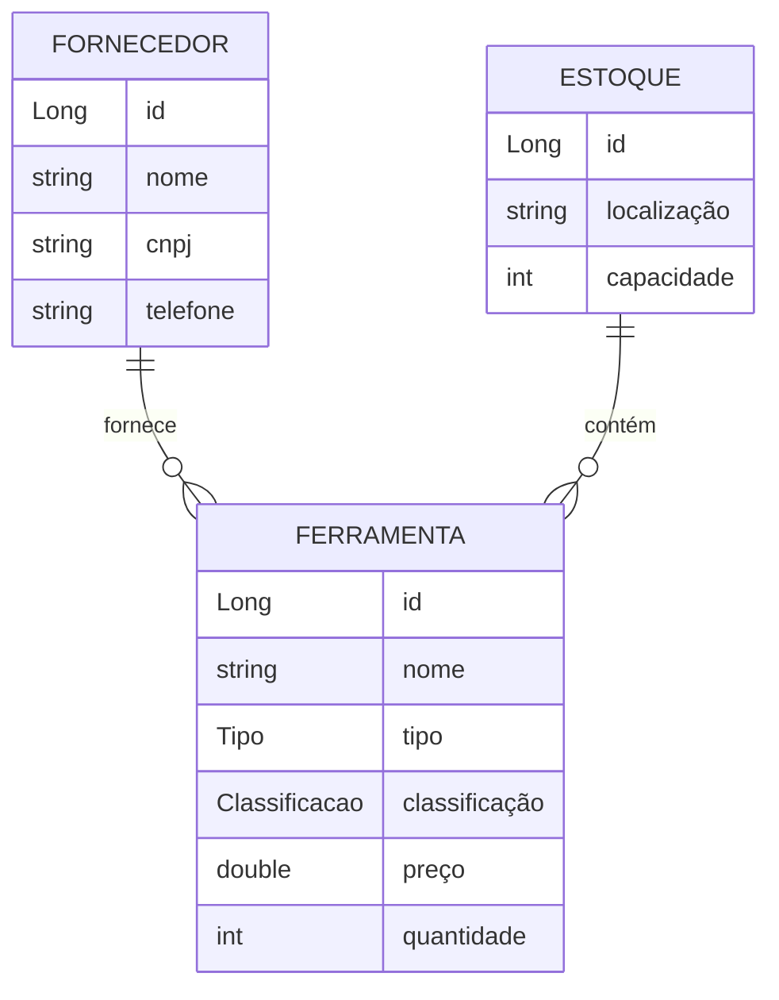

# 📦 ConsertaJá - Gestão de Ferramentas e Estoques  

[]()  
[]()  
[]()  
[]()  

**ConsertaJá** é uma aplicação web completa desenvolvida com **Spring Boot**, voltada para o gerenciamento de **fornecedores, ferramentas e estoques**.  
O sistema foi projetado para proporcionar uma **experiência simples, organizada e eficiente**, garantindo controle de capacidade, rastreabilidade de itens e gestão de relacionamentos entre entidades.  

---

## ✨ Principais Funcionalidades  

- 🔹 **Gestão de Fornecedores**:  
  Cadastro, edição, listagem e exclusão de fornecedores. Inclui validações específicas como **CNPJ** e **telefone**.  

- 🔹 **Gestão de Ferramentas**:  
  Administração de um catálogo de ferramentas, contendo tipo, classificação, tamanho, preço e quantidade disponível.  

- 🔹 **Controle de Estoques**:  
  Definição de locais de armazenamento com capacidade específica, vinculando ferramentas a cada estoque.  

- 🔹 **Validação de Capacidade**:  
  Impede automaticamente que ferramentas sejam adicionadas além da capacidade do estoque, exibindo mensagens de erro claras.  

- 🔹 **Relacionamento de Dados**:  
  As ferramentas estão sempre associadas ao seu fornecedor e a um estoque.  

- 🔹 **Dashboard**:  
  Página inicial com visão geral rápida do número total de fornecedores, ferramentas e estoques.  

- 🔹 **Interface Responsiva**:  
  Desenvolvida com **Thymeleaf + Bootstrap**, garantindo usabilidade em dispositivos desktop e mobile.  

- 🔹 **Tratamento de Erros**:  
  Páginas customizadas para erros comuns (400, 404, 500) e mensagens específicas para regras de negócio.  

---

## 🛠️ Stack Tecnológica  

**Backend**  
- Java 17  
- Spring Boot 3 (Web, Data JPA, Validation)  

**Frontend**  
- Thymeleaf  
- Bootstrap 5  
- HTML5 & CSS3  

**Banco de Dados**  
- Oracle Database  

**Build & Deploy**  
- Maven  
- Docker  

---

## 🚀 Como Rodar o Projeto  

### 🔧 Pré-requisitos  
- JDK 17+  
- Apache Maven  
- Banco de Dados Oracle disponível  
- Docker (opcional, para execução containerizada)  

### ⚙️ Configuração  

1. Clone o repositório:  
   ```bash
   git clone https://github.com/RafaellSouzaPinto/ConsertaJa-part2.git
   cd ConsertaJa-part2
   ```

2. Configure as variáveis de ambiente (ou no `application.properties`):  
   - `DB-LINK`: URL JDBC do Oracle (ex: `jdbc:oracle:thin:@localhost:1521:xe`)  
   - `DB-USER`: usuário do banco  
   - `DB-PASSWORD`: senha do banco  

---

### ▶️ Executando com Maven  

- macOS/Linux:  
  ```bash
  ./mvnw spring-boot:run
  ```
- Windows:  
  ```bash
  .\mvnw.cmd spring-boot:run
  ```

O sistema estará disponível em: **http://localhost:8081**  

---

### 🐳 Executando com Docker  

1. Build da imagem:  
   ```bash
   docker build -t consertaja .
   ```
2. Rodar o container:  
   ```bash
   docker run -p 8081:8081 \
     -e DB-LINK="sua_jdbc_url" \
     -e DB-USER="seu_usuario" \
     -e DB-PASSWORD="sua_senha" \
     consertaja
   ```

---

## 📂 Estrutura do Projeto  

```
src/main/java/consertaJa/ConsertaJa/
│── controller/       # Controladores (Web Layer)
│── dto/              # DTOs (transferência de dados)
│── model/            # Entidades JPA
│── repository/       # Repositórios Spring Data JPA
│── service/          # Lógica de negócio
│── exception/        # Tratamento de exceções customizadas
│── annotations/      # Anotações de validação (CNPJ, Telefone)
src/main/resources/
│── templates/        # Templates Thymeleaf
│── application.properties
Dockerfile
pom.xml
```

---

## 🌐 Endpoints Principais  

| Rota                     | Descrição                                  |
|---------------------------|--------------------------------------------|
| `/` ou `/home`            | Dashboard inicial com estatísticas         |
| `/fornecedores`           | Lista todos os fornecedores                |
| `/fornecedores/novo`      | Formulário para novo fornecedor            |
| `/fornecedores/{id}/editar` | Editar fornecedor existente             |
| `/ferramentas`            | Lista todas as ferramentas                 |
| `/ferramentas/nova`       | Cadastro de nova ferramenta                |
| `/ferramentas/{id}/editar` | Editar ferramenta existente              |
| `/estoques`               | Lista todos os estoques                    |
| `/estoques/novo`          | Cadastro de novo estoque                   |
| `/estoques/{id}/editar`   | Editar estoque existente                   |
| `/sobre`                  | Informações sobre o projeto e equipe       |

---

## 🔗 Deploy & Demonstração  

[](https://consertaja-part2.onrender.com)  

[](https://youtu.be/067wtbeC9eE)  

---

## 🗂️ Relacionamento de Entidades  



---

## 👨‍💻 Equipe  

- **Rafael Souza Pinto** – RM: 555130 
- **Wesley Sena** – RM: 558043
- **Samra Victoria** - RM: 558719
- **Vanessa Yukari** - RM: 558092 

